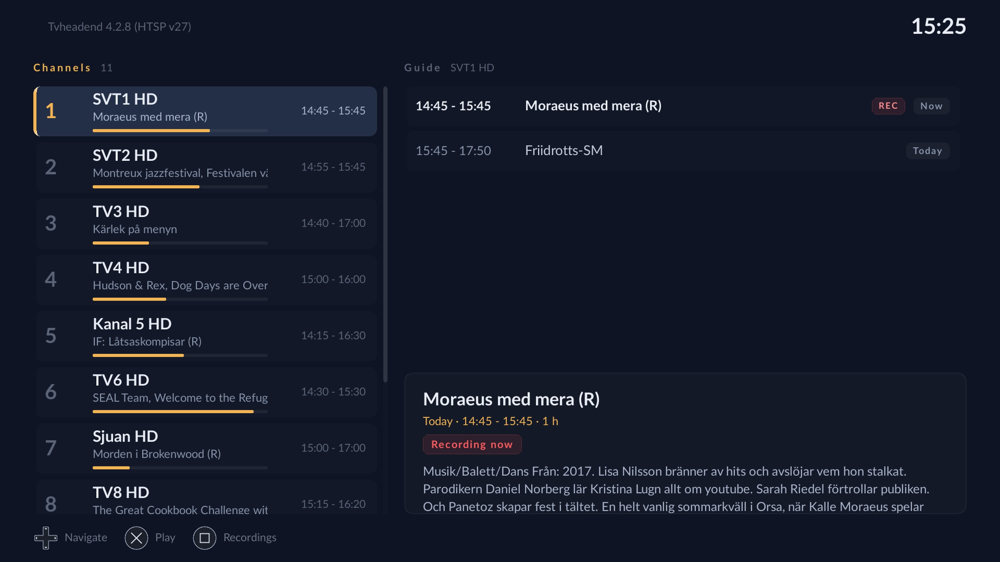

# tvhp

A [Tvheadend](https://tvheadend.org/) client for jailbroken PlayStation 5
consoles where the majority of the source code was generated by Claude.ai
(including ths readme).

It speaks HTSP directly — no transcoding proxy, no browser — and
decodes the stream with FFmpeg, so live TV and recordings play from the same
connection that carries the channel list and the guide.



## Features

- **Live TV** — channel list with now/next and a progress bar, full programme
  guide per channel, full-screen playback with channel zapping.
- **Scheduling** — record any programme from the guide with one button
- **Recordings** — browse everything the DVR holds, play it back, and cancel
  or delete entries.
- **Playback of recordings over HTSP**, using the server's file API.
- **Multiple servers** — save as many as you like and switch between them
  without restarting.
- Designed for a 1920x1080 screen at couch distance: large type, high
  contrast, and a single unmistakable focus colour.

## Requirements

- A jailbroken PS5 running [ps5-payload-dev/websrv][websrv] or an equivalent
  homebrew launcher.
- A Tvheadend server reachable on your network, with an HTSP user. The default
  HTSP port is 9982.
- HTSP protocol version 8 or later for recording playback. `tvhp` announces
  version 35; anything Tvheadend 4.2 or newer is comfortably sufficient.

[websrv]: https://github.com/ps5-payload-dev/websrv

## Install

Download `TVHP.zip` from the [releases page][releases] and unpack it into its
own folder under `/data/homebrew` on the console, so you end up with:

```
/data/homebrew/TVHP/
├── tvhp              # the payload
├── homebrew.js       # tells the launcher what to run
├── assets/           # RML documents, stylesheets, icons
├── fonts/
└── sce_sys/
    └── icon0.png
```

`TVHP` then appears in the Homebrew Launcher. Copying the folder over FTP or
onto USB both work, depending on how your launcher is set up.

[releases]: ../../releases


## Known limitations

- Channel icons are fetched from the server but not displayed yet.
- Only programme-based recording is exposed. The client can also schedule a
  manual time range (`HtspClient::RecordTimespan`), but nothing in the UI
  calls it.
- No series recording: `autorec` and `timerec` rules are neither listed nor
  editable.
- No transcoding profile selection; the server's default is used.
- Rebuilding the resampler at a mid-stream audio format change discards a few
  milliseconds, so there can be a very brief gap at, for example, an ad break.
